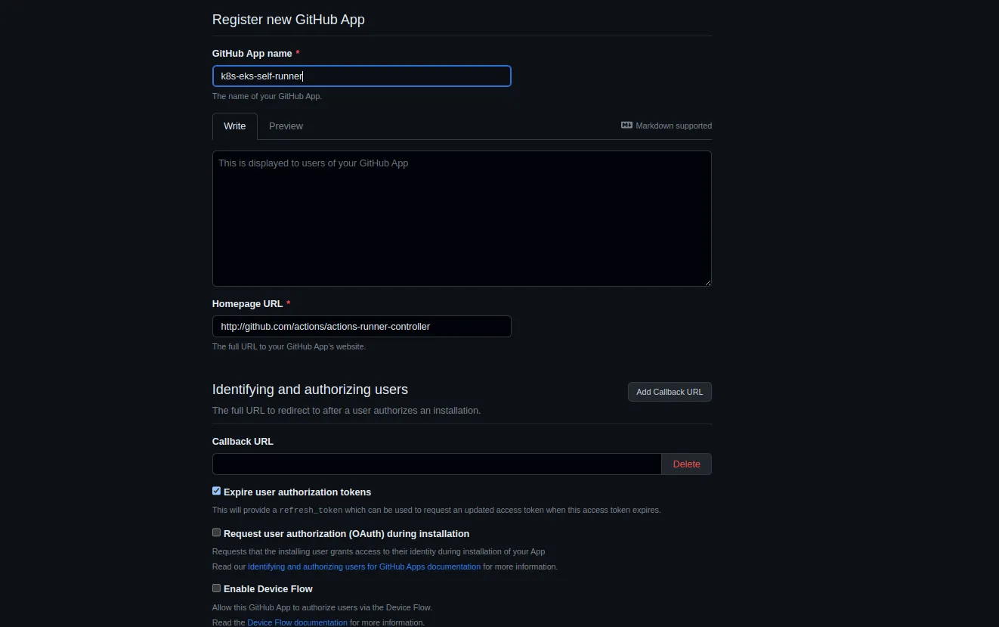
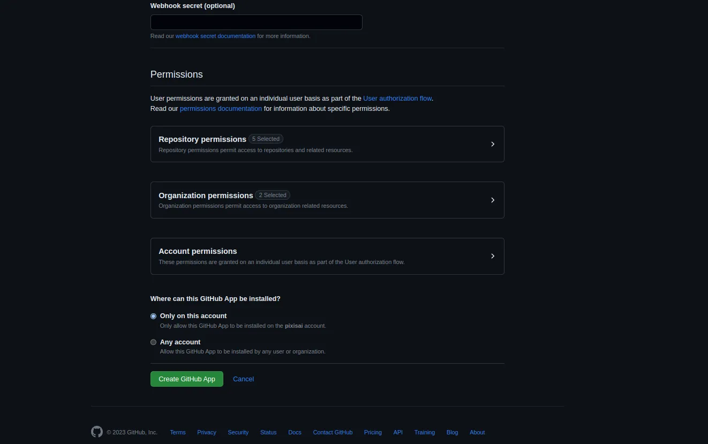
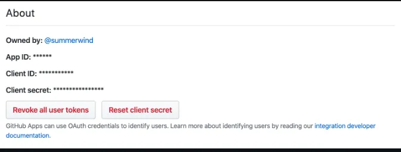
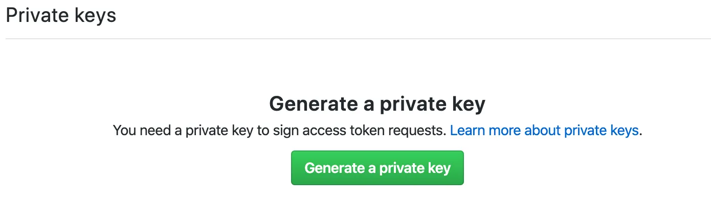
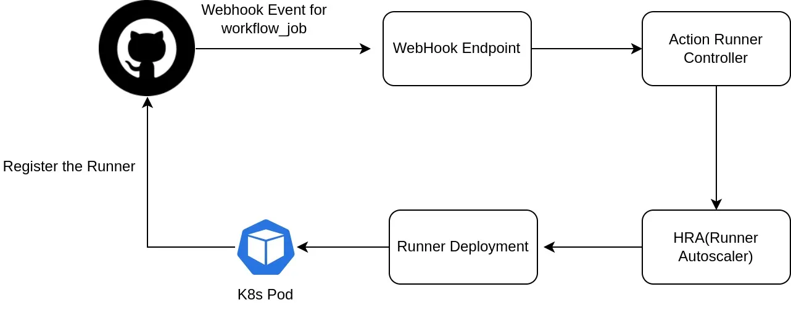
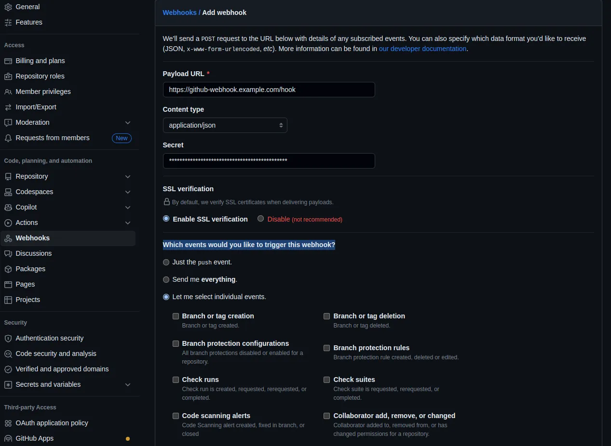
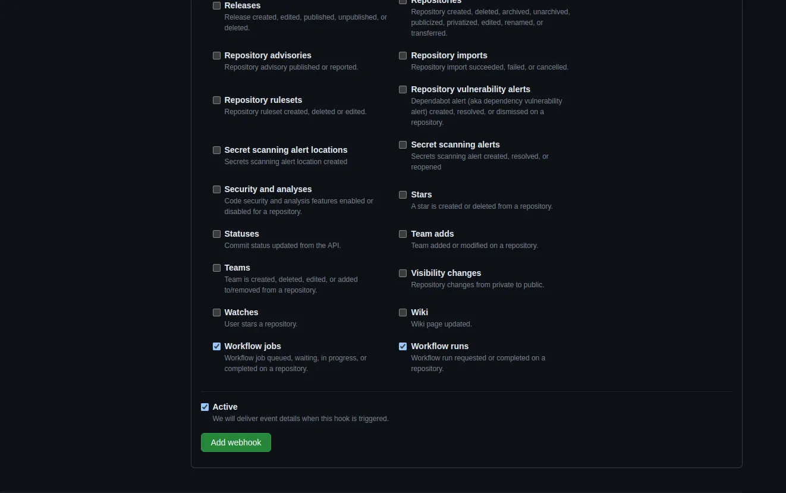
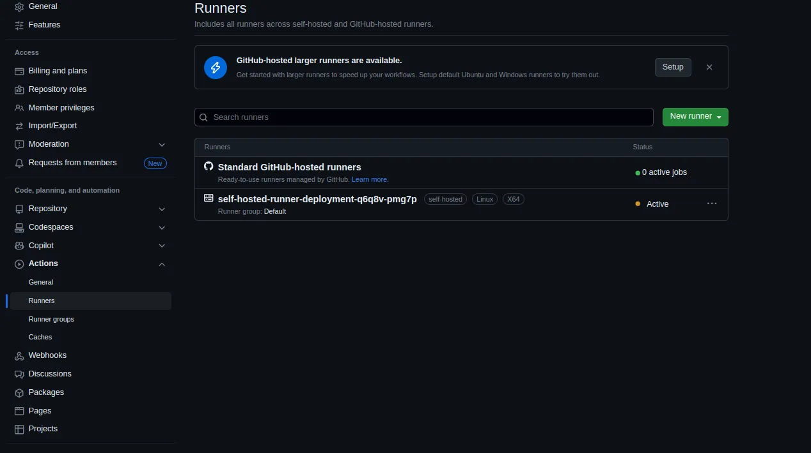

# How to Setup Self Hosted GitHub Action Runner on Kubernetes

A step-by-step guide to setting up a self-hosted GitHub action runner in Kubernetes


GitHub Actions is a powerful CI/CD tool that enables developers to build, test, and deploy software using customizable workflows. It provides managed infrastructure for running actions, but there are instances when running workflows on your self-hosted infrastructure becomes essential.

In this blog, we will learn how to set up and use self-hosted runners with GitHub Actions to optimize workflows and improve the development process.

# **Why Choose Self-Hosted GitHub Runners?**

GitHub-managed runners are costly. For example, GitHub-hosted Linux runners with 2vCPU incur a cost of 0.008$/minute, whereas deploying the same on a self-hosted runner with 2vCPU/4GB (t3a.medium in Mumbai region) RAM only costs 0.00041$/minute.

You can easily fulfill security and compliance requirements: Self-hosted runners may be necessary for accessing private databases or Redis instances during the CI process.

You might have custom hardware requirements, such as dedicated GPU instances.

**Prerequisites**

To implement self-hosted runners, you should have the following in place:

-   A Kubernetes cluster
-   Helm and kubectl installed on your machine
-   Access to a GitHub organization for configuring the GitHub app and webhook.

# Implementation

Following are the steps to set up an organization-level container-based runner within an EKS cluster.

## 1. Install CertManager

> Use the following helm command to install CertManager for SSL. You can skip this step if CertManager is already installed in your cluster.

```bash
$ helm install \  
cert-manager jetstack/cert-manager \  
 - namespace cert-manager \  
 - create-namespace \  
 - version v1.13.0 \  
 - set installCRDs=true
```
## **2. Authenticate the Action Runner Controller with GitHub**

First, we need to set up a mechanism to authenticate the action runner controller to GitHub. This can be done in two ways:

-   **PAT (Personal Access Token)**
-   **Using GitHub App**

We will use the GithubApp method for authentication.

To create a GitHub App for your organization, replace the ‘:org’ part of the following URL with your organization name before opening it. Then, enter any unique name in the “GitHub App name” field.

[Create GitHub Apps for your organization](https://github.com/organizations/:org/settings/apps/new?url=http%3A%2F%2Fgithub.com%2Factions%2Factions-runner-controller&webhook_active=false&public=false&administration=write&organization_self_hosted_runners=write&actions=read&checks=read).

Select the below-mentioned permission for this app and hit the “Create GitHub App” button at the bottom of the page to create a GitHub App.

**_Repository Permissions_**

-   Actions (read only)
-   Administration  (read and write)
-   Checks (read only)
-   Metadata (read only)
-   Pull requests (read only)

**_Organization Permissions_**

-   Self-hosted runners (read/write)
-   Webhooks(read and write)



Github console for creating new github app



Permission section for GitHub app

You will get an App ID on the page of the GitHub App you created as follows. The value of this App ID will be used later.



App ID

Download the private key file by pushing the “Generate a private key” button at the bottom of the GitHub App page for later use.



Generate a private key button

When the installation is complete, you will be taken to a URL in one of the following formats. The last number of the URL will be used as the Installation ID later (for example, if the URL ends in settings/installations/12345, the Installation ID is 12345).

> You may refer to these GitHub links:  [Installation](https://github.com/settings/installations/$%7BINSTALLATION_ID%7D)  and  [Eventreactor installation](https://github.com/organizations/eventreactor/settings/installations/$%7BINSTALLATION_ID%7D).

Finally, register the App ID (APP_ID), Installation ID (INSTALLATION_ID), and the downloaded private key file (PRIVATE_KEY_FILE_PATH) as Kubernetes secrets using the following command:

> kubectl command to create k8s secret

```bash
$ kubectl create secret generic controller-manager -n actions \  
 - from-literal=github_app_id=YOUR_GITHUB_APP_ID \  
 - from-literal=github_app_installation_id=YOUR_INSTALLATION_ID \  
 - from-literal=github_app_private_key=YOUR_PRIVATE_KEY
```
## 3. Install the Action Runner Controller (ARC)

ARC is a Kubernetes controller that creates self-hosted runners on your Kubernetes cluster. It comprises several custom resource definitions such as (Runner, Runner Set, Runner Deployment, Runner Replica Set, and Horizontal Runner AutoScaler), which are analogous to Kubernetes resources like pods, replica sets, deployments, stateful sets, and HPAs.).

> To install the Action Runner Controller in the “actions” namespace, use the Helm following CLI command:

```bash
$ helm repo add actions-runner-controller https://actions-runner-controller.github.io/actions-runner-controller  
$ helm repo update  
$ helm install \  
actions-runner-controller actions-runner-controller/actions-runner-controller \  
 - namespace actions \  
 - create-namespace \  
 - version 0.22.0 \  
-f runner-controller.yaml
```
> sample runner-controller.yaml file used in above step.

```yaml
replicaCount: 1  
webhookPort: 9443  
syncPeriod: 1m  
defaultScaleDownDelay: 5m  
enableLeaderElection: true  
  
authSecret:  
  enabled: true  
  create: false  
  name: "controller-manager"  
  
image:  
  repository: "summerwind/actions-runner-controller"  
  actionsRunnerRepositoryAndTag: "summerwind/actions-runner:ubuntu-20.04"  
  dindSidecarRepositoryAndTag: "docker:dind"  
  pullPolicy: IfNotPresent  
  
serviceAccount:  
  create: true  
  
service:  
  type: ClusterIP  
  port: 443  
  
certManagerEnabled: true  
  
logFormat: text  
  
githubWebhookServer:  
  enabled: false
```

## 4. Configure Autoscaling

You can automatically adjust the number of self-hosted runners in your environment based on pull-driven or webhook-driven scaling metrics.

-   **Pull-driven Scaling**

Pull-driven scaling performance is bound by the sync period/polling interval. Initially, we started using pull-driven scaling. But we ended up with a slow/cold starting period issue.

For performance improvement, we tried to reduce the polling interval. However, it ended up in an API rate limit issue.

So, we switched to webhook-driven scaling for better performance.

-   **Webhook-driven Scaling**

Webhook-driven scaling is performed based on the number of webhook events from GitHub.

The benefit of auto-scaling on webhooks compared to pull-driven scaling is that ARC is immediately notified of the scaling need.

## **Webhook-driven Scaling Architecture**



Webhook Driven Scaling

Webhook events are processed by a separate webhook server. The webhook server receives workflow_job webhook events and scales RunnerDeployments/RunnerSets by updating HRAs configured for the webhook trigger.

**Register the webhook server to GitHub**

1.  Go to your GitHub organization settings and click on Add Webhook
2.  In the payload URL, add the https endpoint you deployed with the runner controller for your webhook server
3.  In content type, select application/JSON
4.  Under the secret button, add a random string that we will use as a webhook secret
5.  Keep SSL verification on for webhook
6.  Select the events for which you would like to trigger this webhook.

For this example, let’s select individual events. Opt for Workflow job and workflow runs



Github console for webhook registration



Selecting the events for webhook

> kubectl command to create secret for webhook token

```bash
$ kubectl create secret generic github-selfhosted-webhook-token -n acti\   
- from-literal=SELFHOSTED_GITHUB_WEBHOOK_SECRET_TOKEN=YOUR_WEBHOOK_SECRET
```

Upgrade the ARC to enable the webhook server.

> **_Note: This step assumes you have already configured_** `**_cert-manager_**` **_and domain name for your cluster._**

```bash
$ helm upgrade --install \  
actions-runner-controller actions-runner-controller/actions-runner-controller \  
 - namespace actions \  
 - create-namespace \  
 - version 0.22.0 \  
-f runner-controller.yaml
```
> sample runner-controller.yaml file used in above step

```yaml
replicaCount: 1  
webhookPort: 9443  
syncPeriod: 1m  
defaultScaleDownDelay: 5m  
enableLeaderElection: true  
  
authSecret:  
  enabled: true  
  create: false  
  name: "controller-manager"  
  
image:  
  repository: "summerwind/actions-runner-controller"  
  actionsRunnerRepositoryAndTag: "summerwind/actions-runner:ubuntu-20.04"  
  dindSidecarRepositoryAndTag: "docker:dind"  
  pullPolicy: IfNotPresent  
  
serviceAccount:  
  create: true  

# Webhook service resource  
service:  
  type: ClusterIP  
  port: 443  
  
certManagerEnabled: true  
  
logFormat: text  
  
githubWebhookServer:  
  enabled: true  
  replicaCount: 1  
  useRunnerGroupsVisibility: false  
  logFormat: text  
  secret:  
    enabled: true  
    create: false  
    name: github-selfhosted-webhook-token  
  serviceAccount:  
    create: true  
  ingress:  
    enabled: true  
    annotations:  
      nginx.ingress.kubernetes.io/backend-protocol: "HTTP"        
    ingressClassName: my-ingress-class  
    tls:  
     - hosts: git-webhook.example.com  
       secretName: git-webhook-ssl  
    hosts:  
      - host: git-webhook.example.com  
        paths:  
        - path: /  
          pathType: Prefix

```

Once the webhook setup is completed, go to GitHub to check if it is working. If it is, you'll see a green V mark alongside your webhook on the Settings -> Webhooks page.

## 5. Use Self-hosted Runners in a Workflow

To use a self-hosted runner in our workflow, set up runner deployment and HorizontalRunnerAutoscaler.

Runner Deployment is k8s CRD similar to deployment objects of k8s. It will have the resource definitions, runner scope, label, etc. Following runner deployment is created with org-level scope.

> runnerdeployment.yaml

```yaml
apiVersion: actions.summerwind.dev/v1alpha1  
kind: RunnerDeployment  
metadata:  
  annotations:  
    karpenter.sh/do-not-evict: "true"  
  name: self-hosted-runner-deployment  
  namespace: actions  
spec:  
  template:  
    Spec:  
      labels:  
        - self-hosted-linux  
      image: "<docker-image-for-runner>/by default it use summerwind/actions-runner:ubuntu-20.04"  
      organization: <your-organization-name>  
      resources:  
        requests:  
          cpu: 1500m  
          memory: 2000Mi
```

HorizontalRunnerAutoscaler (HRA) is a CRD similar to HorizontalPodAutoscaler (HPA) object of Kubernetes. It will scale the runner deployment based on the metrics we mention in its definition. The following runner will scale the runner deployment based on the webhook events.

> horizontalrunnerautoscaler.yaml

```yaml
apiVersion: actions.summerwind.dev/v1alpha1  
kind: HorizontalRunnerAutoscaler  
metadata:  
  name: self-hosted-runner-deployment-autoscaler  
  namespace: actions  
spec:  
  maxReplicas: 30  
  minReplicas: 0  
  scaleTargetRef:  
    kind: RunnerDeployment  
    name: self-hosted-runner-deployment  
  scaleUpTriggers:  
  - duration: 30m  
    githubEvent:  
      workflowJob: {}
```

> kubectl command to create runnerdeployment and horizontalrunnerautoscaler

```bash
$ kubectl apply -f runnerdeployment.yaml horizontalrunnerautoscaler.yaml 
```

To run a workflow job on a self-hosted runner, We need to use the labels mentioned in runner deployment in the workflow job. For example, in the previous step, we created a runnerdeployment with the label “self-hosted-linux”.

> github action workflow file snippet

```yaml
jobs:  
  release:  
    runs-on: self-hosted-linux
```

You can monitor the self-hosted runner details on the GitHub console once your GitHub workflow starts and the self-hosted runner is registered.



self-hosted runner detail in GitHub

If your organization needs different types of runners, you will have to create multiple runnerdeployment and HRA with appropriate labels.

## Limitations

-   GitHub runners might experience a 2–4 minute cold start period if the minimum node capacity is set to 0.
-   When using a self-hosted runner in a private network with NAT gateways for internet access, you may encounter Docker pull rate limits. DockerHub has a limit of 100 pulls per 6 hours per IP address. To overcome this issue, utilize the public subnet of your network.
-   You need to manage the runner images as per your organization's requirements.

# **Wrapping Up**

The use of self-hosted runners in GitHub Actions provides an advantage in terms of flexibility, control, and the extent of customization compared to relying on shared runners or cloud-based alternatives.

Nevertheless, it’s worth noting that the setup and ongoing management of self-hosted runners demand an added commitment of effort and resources. Therefore, it’s essential to weigh the benefits against the costs and resources needed to maintain them.

