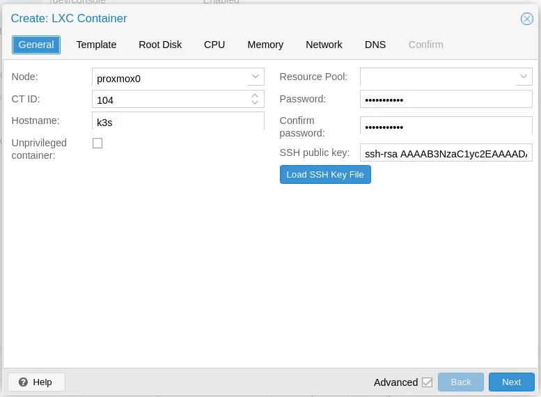
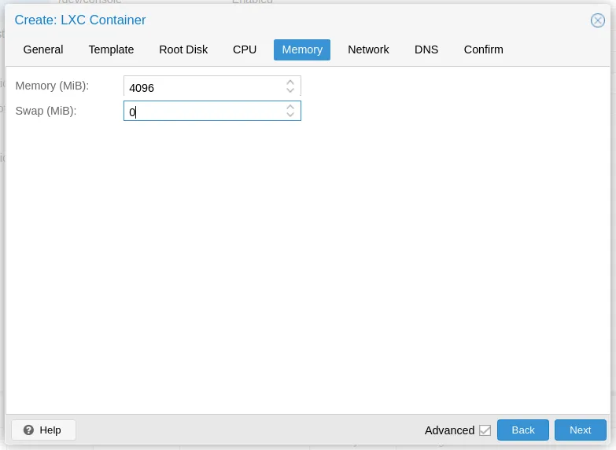
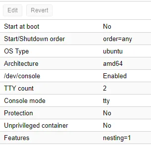

## Step 1: prepare the host

Because LXC containers share the host’s kernel, we have to prepare the host. This means disabling the swap and also loading a couple of modules.

### Sysctl changes

First I adapt the sysctl file on the host:

```
$ vim /etc/sysctl.conf
```

Uncomment the following line:

```
#net.ipv4.ip_forward=1
```

And add:

```
vm.swapiness=0
```

### Disable swap:

```
$ swapoff -a
```

After that adapt the fstab file:

```
$ vim /etc/fstab
```

Comment out the following line:

```
/dev/pve/swap none swap sw 0 0
```

> **_NOTE:_** After disabling swap on host I did a reboot of the full host, I don’t know if this is needed but wanted to be sure…

> **_Alternative Solution:_**
> ```
> $ systemctl restart systemd-sysctl
> $ systemctl daemon-reload
> ```

# Step 2: Create an LXC container

I both tested with Ubuntu and Debian, but for Debian it is important that you’re Proxmox version is at least 7.0.0. Else you will get errors…

#### Make the container unprivileged:



<h6 style="text-align: center;">Setting up LXC to unprivileged
</h6>

#### Disable swap inside the container:
Kubernetes will not initialize if the swap is not disabled.



<h6 style="text-align: center;">Disable swap</h6>

#### Enable Nesting:
You can find this options under “Options” after creating the LXC container.



<h6 style="text-align: center;">Features: nesting=1</h6>

# Step 3: Change container config file

Before we startup the LXC container, we have to change the config file that is created.

#### Edit the config file of the container:

You can locate the config file here:  _“/etc/pve/lxc/$ID.conf”._ The $ID need to be filled in with the container ID of the container you just created. You can find the ID in front of the name.


<h6 style="text-align: center;">Container ID</h6>

####  Add the following to the config file:

```
lxc.apparmor.profile: unconfined  
lxc.cgroup2.devices.allow: a  
lxc.cap.drop:  
lxc.mount.auto: "proc:rw sys:rw"
```

# Step 4: Apply some configuration inside the LXC container

For the last step we have to create some missing files inside of the container, because in the Proxmox Ubuntu LXC template they are missing.

#### Create `/etc/rc.local`

```bash
#!/bin/sh -e  
# Kubeadm 1.15 needs /dev/kmsg to be there, but it’s not in lxc, but we can just use /dev/console instead  
# see: [https://github.com/kubernetes-sigs/kind/issues/662](https://github.com/kubernetes-sigs/kind/issues/662)if [ ! -e /dev/kmsg ]; then  
ln -s /dev/console /dev/kmsg  
fi# [https://medium.com/@kvaps/run-kubernetes-in-lxc-container-f04aa94b6c9c](https://medium.com/@kvaps/run-kubernetes-in-lxc-container-f04aa94b6c9c)  
mount --make-rshared /
```

After creating this file we setup the permissions and reboot.

```
$ chmod +x /etc/rc.local  
/etc/rc.local
```