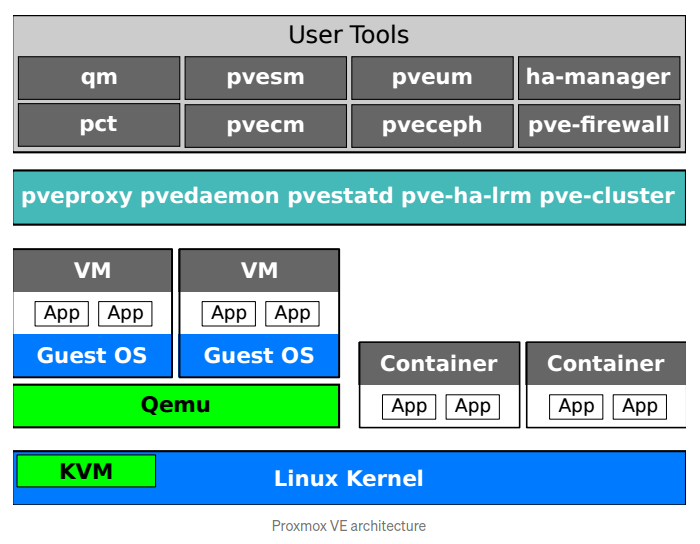
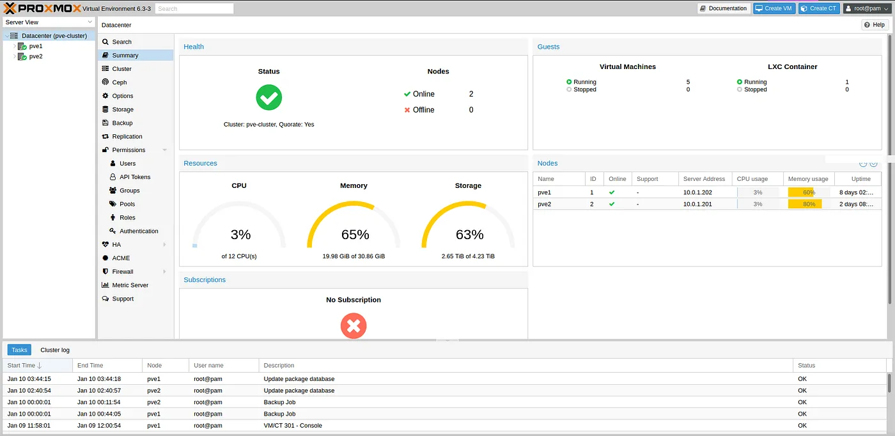
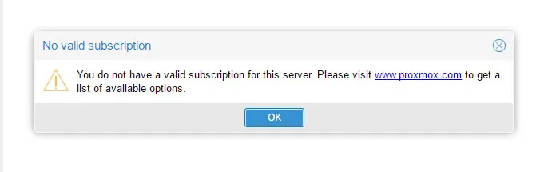
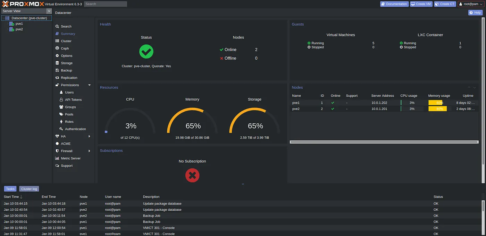
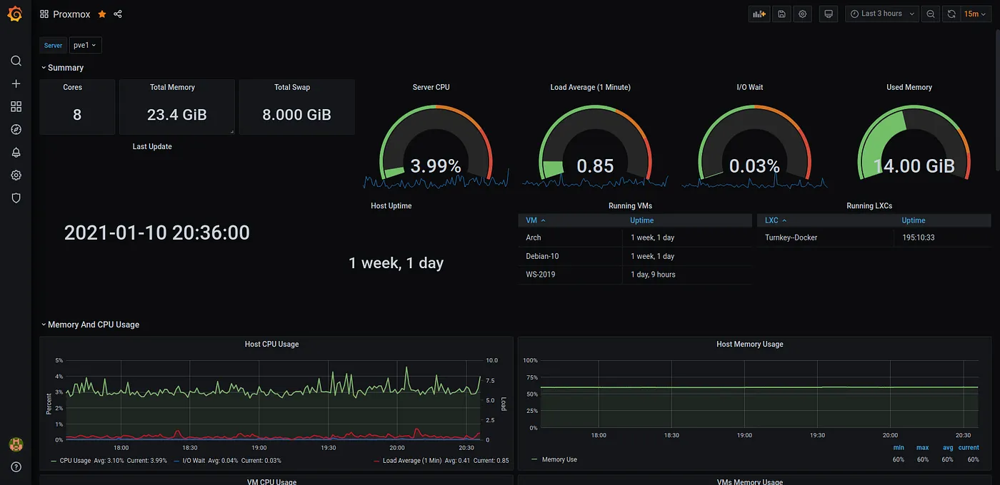

# Proxmox 101


Feb 13, 2021

# What is Proxmox?? 🤔

Proxmox VE is an open-source server management platform for your enterprise virtualization. It tightly integrates KVM hypervisor and LXC, software-defined storage, and networking functionality on a single platform. With the integrated web-based user interface you can easily manage VMs and containers, highly available clusters, or the integrated disaster recovery tools with ease. Proxmox VE is under the GNU Affero General Public License (V3), there is simple subscription structure for those who are interested in more than community support. Simplicity is great advantage of PVE over other virtualization solutions. even a novice user can setup and install it within minutes. And most importantly because it is running on Debian, all Linux experience apply.

Proxmox implements also non-Docker , container based virtualization with LXC. It provides a small wrapper called pct which I can use to connect to LXC containers after ssh to host, by just typing ‘pct enter 108’, where 108 is ID of the container. Command line can be used to manage VMs, (QEMU ‘qm’ commands, i.e. qm stop 105).

Proxmox VE provides for live migration — the movement of a virtual machine or container from one cluster node to another without any disruption of services. The cluster file system (“pmxcfs”) is a database-driven file system for storing configuration files, replicated in real time to all cluster nodes using Corosync. It is used to store all PVE related configuration files i.e.

If your mind not clear about how proxmox actually works than this architecture diagram will help you ⤏



# Minimum Requirements

-   CPU: 64bit (Intel EMT64 or AMD64)
-   Intel VT/AMD-V capable CPU/Mainboard (for KVM Full Virtualization support)
-   Minimum 8GB RAM ( Recommanded 16+ or as far as you go ( There is no end of cool selfhosted things!))
-   Hard Drive
-   One NIC

Note: If you want to compare proxmox with any other virtualization solution or looking for any specific feature. Look it here ⤏  [Proxmox vs OtherVE](https://www.proxmox.com/en/proxmox-ve/comparison)

Other Note — For homelab you can use old PC, laptop, any Mini PC like ( Intel NUC, Hp, Lenevo, Dell Mini PC Clients ( they are around 200–300 $))

So, enough of intro now. Let’s install this thing.

# Installation

-   Step1 — Pick You USB ( 8GB Size )
-   Step2 — Download  [Proxmox VE ISO](https://www.proxmox.com/en/downloads/category/iso-images-pve)
-   Step3 — Download  [balenaEtcher](https://www.balena.io/etcher/)  or  [Rufus](https://rufus.ie/)
-   Step4 — Put USB into your PC/Laptop & use any one of booting tool
-   Step5 — Put your USB into you Bare Metel machine ( Make sure to config boot order ) and its shows you a start screen of proxmox.

Note — If you are using Rufus make sure use  `DD mode`.



<h6 style="text-align: center;">Proxmox Dashboard</h6>

# Post Installation Tasks

-   Proxmox Installer show Private IP ( when installing ), now go to that IP (  [https://IP:8006](https://ip:8006/)  ) and use your credentials ( You set when installing ) and BANG ⤏ You will see your own mini data center console!

## Task — 1: Remove Subscription Message



<h6 style="text-align: center;">Subscription Message</h6>

```bash
# Proxmox 6.2 and UP
# STEP1 - ssh to your proxmox server

# STEP2 - go to this dir
$ cd /usr/share/javascript/proxmox-widget-toolkit/

# STEP3 - create a backup of you proxmoxlib.js
$ cp proxmoxlib.js proxmoxlib.js.bak

# STEP3 - now edit proxmoxlib.js
$ vim proxmoxlib.js
# Search for
Ext.Msg.show({
  title: gettext('No valid subscription'),

# Replace with
void({
  title: gettext('No valid subscription'),

# STEP4 - Restart preproxy service
$ systemctl restart pveproxy.service

# To Check ( it'ss working or not )
$ grep -n -B 1 'No valid sub' proxmoxlib.js
# Note: After this clear browser cache and restart the browser
```
<h6 style="text-align: center;">Remove Subscription Message</h6>

## TASK — 2: Setup Community Subscription Repo

Setup Community Repository
```bash

# Proxmox by default updates from subscription based repo, for without subscription based repo update. We need to do some extra steps:

# Edit /etc/apt/sources.list ( add this )
$ vim /etc/apt/sources.list

# Not for production use
deb http://download.proxmox.com/debian buster pve-no-subscription


$ cd /etc/apt/sources.list.d
$ cp pve-enterprise.list pve-enterprise.list.bak
$ vim pve-enterprise.list
# comment out this line : deb https://enterprise.proxmox.com/debian/pve buster pve-enterprise

# Update the system
$ apt update

# Distro upgrade
apt dist-upgrade
```
**Note**  — Now you can update your proxmox in future.

## TASK — 3 Setup a Dark Theme 😎

```bash
# Github Repo for this Project: https://github.com/Weilbyte/PVEDiscordDark

# Download the Python Script & Run
$ wget https://raw.githubusercontent.com/Weilbyte/PVEDiscordDark/master/PVEDiscordDark.py
$ python3 PVEDiscordDark.py
```



<h6 style="text-align: center;">Proxmox Dark Theme</h6>

Note — — 👏 Thank You Creator 👏 ( So much relief to the eyeballs! )

# Add Storage Drives

## ZFS Pools

It is recommended by proxmox and other peoples to use ZFS Pools for Storing your VMS ( It gives you more performance and Redundancy )

```bash
# Setup

# List Drives
$ ls /dev/disk/by-id

# Create a pool
$ zpool create -f -m <mount> <pool> <type> <ids>

- create: subcommand to create the pool.
- -f: Force creating the pool to bypass the “EFI label error”.
- -m: The mount point of the pool. If this is not specified, then the pool will be mounted to root as /pool.
- pool: This is the name of the pool.
- type: mirror, raidz, raidz2, raidz3. If omitted, the default type is a stripe or raid 0.
- ids: The names of the drives/partitions to include in the pool obtained from ls /dev/disk/by-id.

# Eg
$ zpool create -f -m /mnt/zstorage  zstorage raidz2 <ids>

# To check your pool
$ zpool list
$ zpool list -v
$ zpool iostat
$ zpool iostat -v

# Check Proxmox Storage Manager Know it exists:
$ pvesm zfsscan

# configure your ZFS Pool
$ zfs create zstorage/iso
$ zsf create zstorage/share
$ zsf create zstorage/vmstorage
$ zsf create zstorage/cnstorage

# To set quota
$ zfs set quota=1000G zstorage/iso

# To check
$ zfs list
$ zpool status
$ zpool iostat -v

# Now go to the gui -> Datacenter -> storage -> Add -> Directory -> zstorage/iso ( Make sure only “ISO image” and “Container template” are selected. )

# ...Directory -> Add -> ZFS -> Id: vmstorage -> ZFS Pool: /zstorage/vmstorage```

ZFS Pools Configuration

## LVM

No worries, if you have single disk ( Use LVM )

```bash
# List disk devices with lsblk
# Select a device to add
# create partions
$ fdisk /dev/sdb

# format device
$ mkfs.ext4 /dev/sdb1

# Create a physical group
$ pvcreate /dev/sdb1

# Create logical group
$ vgcreate vSSD /dev/sdb1

# TO add DataCenter -> Storage -> Add -> LVM

---

# To add as a dir
# After formatting mount the some dir
$ mkdir /backup
$ mount /dev/sdb1 /backup
$ vim /etc/fstab
/dev/sdb1/ /backup ext4 defaults 0 0

# To add Datacenter -> Storage -> Add -> Directory
```

<h6 style="text-align: center;">Proxmox LVM Setup</h6>

# Backup & Restore VM’s

```bash
# You can directly backup your vm from gui ( but if you want cli method -> )

# To create a backup
$ cd /var/lib/vz/dump
$ vzdump VM_ID  # ( ID Show on GUI Pannel )

# To Restore a VM Image ( x.lzo )
$ cd /var/lib/vz/dump

# To Restore a VM
$ qmrestore vzdump-x-x.lzo VM_ID

# To restore a Container
$ pct restore ID --storage {storage_name} ./x.zst

# Note - You can also setup Proxmox Backup Server ( To Regurlarly Backup your VMS on Remote Storage - https://www.proxmox.com/en/proxmox-backup-server )
```

<h6 style="text-align: center;">Backup and Restore VM’s
</h6>
# Monitor Proxmox with Grafana and InfluxDB

```bash
# Setup Influx DB on any server ( as per os )

# Edit /etc/influxdb/influxdb.conf
[[udp]]
   enabled = true
   bind-address = "0.0.0.0:8089"
   database = "proxmox"
   batch-size = 1000
   batch-timeout = "1s"

# Add InfluxDb to proxmox
# Go to the datacenter -> Metric Server -> Add influxdb server ( 8089 port )

---configs
# DB: proxmox
# user & password ( You set up while setting up a influxdb )

# Add a data source to the grafana with these configurations
# grafan dashboard for proxmox monitoring : 10048
```

<h6 style="text-align: center;">Monitor Proxmox</h6>



<h6 style="text-align: center;">Grafana Dashboard</h6>

# Extra Tip — Setup a Minimal Docker Client

```bash
# Check for turnkey templates, if not shows : Go to Proxmox Server Console ->  `$ pveam update`

# Select turnkey-core ( It is optimized debian Container Image by turnkey project  )
# Note - Uncheck the priviledged container option
# Add resources and bootup container

# Install docker as per debian ( It uses very minimal reosurce, You can setup two three docker container in less then a 1 GB Ram)

# Extra Tip: Select the ID Criteria for Containers & VM's:
- VMS: 100-199
- Containers 300-399

# IP's Criteria
# Containers : x.x.x.151 - 250
# VM's : x.x.x.50 - 150
```