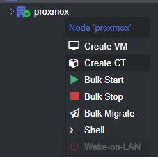
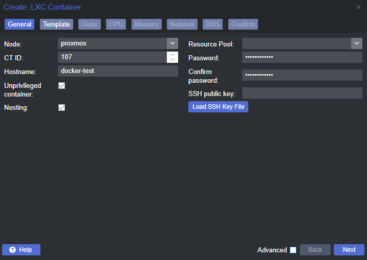
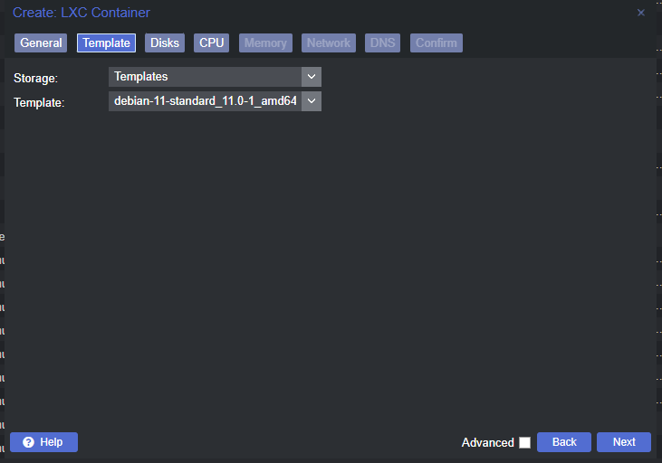
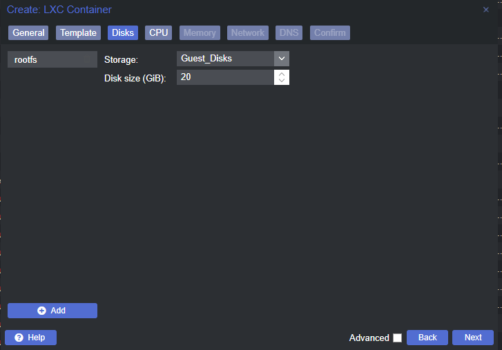
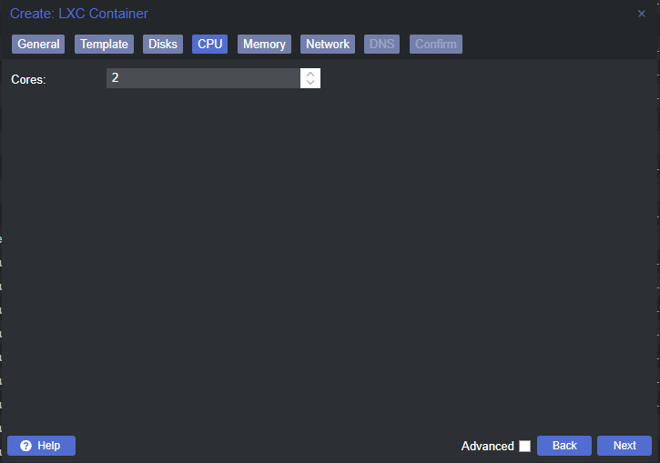
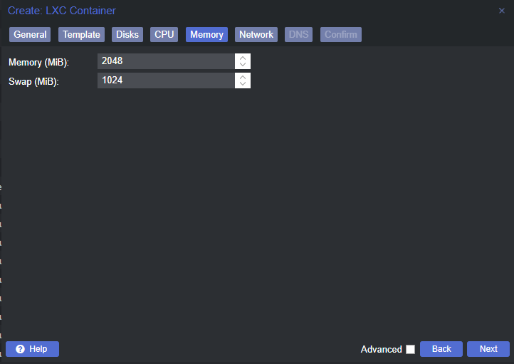
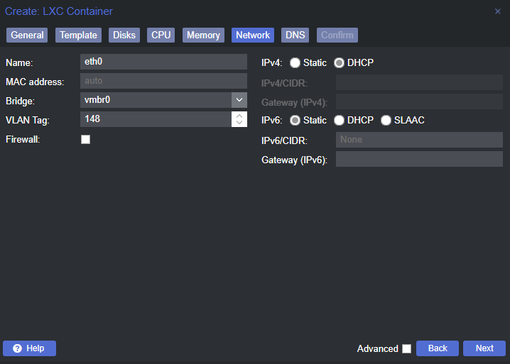
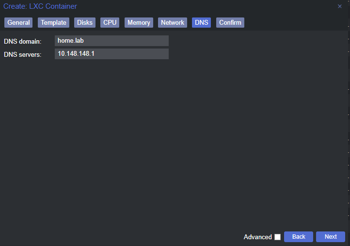
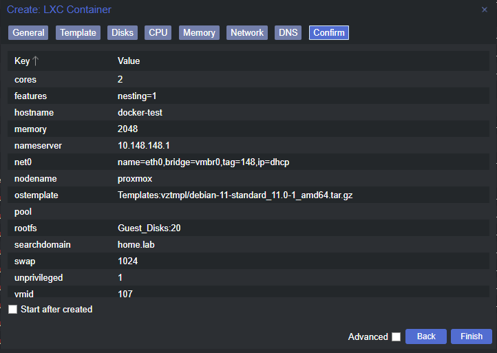
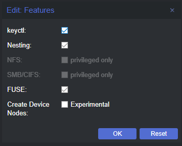

# Run Docker on Linux Containers (LXC)


# Preparing Proxmox

## Ensure FUSE OverlayFS is Installed on the Hypervisor

> **_NOTE:_** `fuse-overlayfs`  is really only required if your Proxmox node's storage backend is ZFS, as my research indicates that this is a requirement for keeping Docker volume sizes from blowing up


```bash
apt clean && apt update
apt install -y fuse-overlayfs
```

# Create a Linux Container and Test Functionality

## Create the Linux Container Based on Ubuntu 24.04 (Noble Numbat) Official Template

> **_NOTE:_** Make sure ZFS storage is selected for the template storage



Right click your node and click 'Create CT'

[](_assets/image-1.png)

Ensure the container is unprivileged and nesting is enabled

[](_assets/image-2.png)

Choose your container template

[](_assets/image-3.png)

Add a disk, size according to your needs

[](_assets/image-4.png)

Allocate cores according to your needs

[](_assets/image-5.png)

Allocate RAM according to your needs

[](_assets/image-6.png)

Set your NIC parameters according to your environment

[](_assets/image-7.png)

I am using my internal domain and DNS server for this VLAN

[](_assets/image-8.png)

Click finish to create the container

  
  

### Change a Few Container Options

[](_assets/image-9.png)

Click on your container

[](_assets/image-10.png)

Click 'Options'

[](_assets/image-11.png)

Double-click 'Features'

> **_NOTE:_** As mentioned earlier, you only need to enable  `FUSE`  if your Proxmox storage backend is ZFS

[](_assets/image-18.png)

Enable 'keyctl', 'Nesting', and 'FUSE'

You may now start the container.


## Configure and Test Docker

### Install and Configure FUSE OverlayFS on the Linux Container

> **_NOTE:_** Repeating here, once again, that you only require  `fuse-overlayfs`  if your Proxmox node storage backend if ZFS

```bash
apt clean && apt update
apt install -y fuse-overlayfs
ln -s /usr/bin/fuse-overlayfs /usr/local/bin/fuse-overlayfs
```


### Install Docker Engine on the Linux Container

```bash
# Ensure pre-requisites are installed
apt install -y ca-certificates curl gnupg lsb-release

# Add Docker GPG key
mkdir -p /etc/apt/keyrings
curl -fsSL https://download.docker.com/linux/ubuntu/gpg | gpg --dearmor -o /etc/apt/keyrings/docker.gpg

# Add Docker apt repository
echo "deb [arch=$(dpkg --print-architecture) signed-by=/etc/apt/keyrings/docker.gpg] https://download.docker.com/linux/ubuntu $(lsb_release -cs) stable" | tee /etc/apt/sources.list.d/docker.list > /dev/null

# Update sources and install Docker Engine
apt update
apt install -y docker-ce docker-ce-cli containerd.io docker-compose docker-compose-plugin

# Test for successful installation
docker run hello-world

# Enable the Docker engine to start at boot
systemctl enable docker
