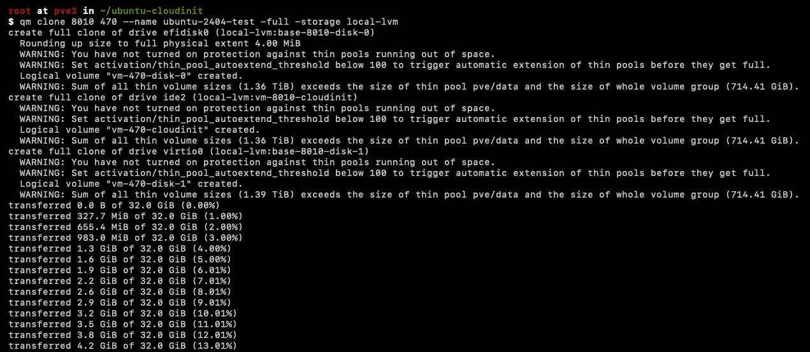
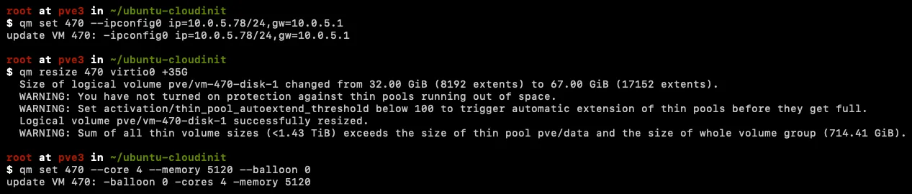

  # Step-by-Step Guide: Creating a Ready-to-Use Ubuntu Cloud Image on Proxmox!!


May 12, 2024


<h6 style="text-align: center;">Proxmox + Cloud Init Images</h6>

In this write-up, I will guide you through the steps to create a ready-to-use Ubuntu cloud image on Proxmox.

## Download Ubuntu cloud images

You can find all the cloud images at  [https://cloud-images.ubuntu.com/](https://cloud-images.ubuntu.com/). For this guide, we will be using the  **Ubuntu Server 24.04 LTS (Noble Numbat)** image.


<h6 style="text-align: center;">Ubuntu Cloud Images</h6>

To download the  **Ubuntu Server 24.04 LTS (Noble Numbat)**  image, run the following command:

```bash
$ wget -q https://cloud-images.ubuntu.com/noble/current/noble-server-cloudimg-amd64.img
```
Next, resize the image to 32G:

```bash
$ qemu-img resize noble-server-cloudimg-amd64.img 32G
```
Please be aware that the image will not occupy a full 32 gigabytes of storage, even though it is being resized to that value. This is due to the image being a sparse file. Initially, the image starts at approximately 2GB in size. It is important to resize the image now to ensure that any cloned virtual machines (VMs) have sufficient storage capacity.

You can customize the desired size by adjusting the value “32G” to your preferred capacity, such as 16, 64, or any other size that suits your needs.


<h6 style="text-align: center;">Download Cloud Image</h6>

## Set up the environment

To begin, export the desired username and password by executing the following command:

```bash
$ export CUSTOM_USER_NAME=ubuntu  
$ export CUSTOM_USER_PASSWORD=password
```
## Create a new VM

We will utilize the  **qm create**  command to generate a new VM. We have assigned it the ID 8010 and named it “ubuntu-2404-cloudinit-template”. The OS type has been set as Linux 2.6/3.x/4.x, while the memory has been allocated 1024 MB.

```bash
$ qm create 8010 --name "ubuntu-2404-cloudinit-template" --ostype l26 \  
    --memory 1024 \  
    --agent 1 \  
    --bios ovmf --machine q35 --efidisk0 local-lvm:0,pre-enrolled-keys=0 \  
    --cpu host --socket 1 --cores 1 \  
    --vga serial0 --serial0 socket  \  
    --net0 virtio,bridge=vmbr0
```

Feel free to customize the VM ID  **8010**  according to your preference, ensuring that you replace it in subsequent commands as well. The allocated memory does not play a critical role since this specific VM will not start. However, you must adjust the RAM for cloned VMs as needed. Enabling the  **— agent**  option ensures the Qemu Guest Agent is active, offering various benefits such as retrieving IP addresses of interfaces.

The CPU type is set to “**host**,” which is typically recommended, with one socket and one core (remember to adjust the core count for cloned VMs). You can choose “**virtio**” as the GPU type instead of “**serial0**” if desired, although it is not necessary.

The “**serial0**” GPU type allows for helpful features like copy and paste functionality. Lastly, if you prefer a specific bridge interface for the network interface (NIC), you can modify “**vmbr0**” to reflect your preferred interface name. If you plan to use a VLAN tag, simply add “,**tag=##**” immediately after the bridge name without any spaces.


<h6 style="text-align: center;">Create a new vm</h6>

## Import the Disk Image to the Local Storage

Next, we will import the downloaded image to the local LVM storage. Ensure that you replace the VMID mentioned in this example (8010) with the actual ID of the VM you created.

```bash
$ qm importdisk 8010 noble-server-cloudimg-amd64.img local-lvm
```


<h6 style="text-align: center;">Add disk image to local storage</h6>

## Configure the Imported Disk

We need to instruct Proxmox to utilize the imported disk as the primary hard disk for the VM.

```bash
$ qm set 8010 --scsihw virtio-scsi-pci --virtio0 local-lvm:vm-8010-disk-1,discard=on
```
## Set Boot Order

To ensure that our VM starts up from the imported disk, we need to set the boot order accordingly.

```bash
$ qm set 8010 --boot order=virtio0
```
## Add Cloud-init Drive

Let’s include an IDE drive that will be dedicated to Cloud-init user-data.

```bash
$ qm set 8010 --ide2 local-lvm:cloudinit
```


<h6 style="text-align: center;">Added hdd and clouddrive to image</h6>

## Creating the vendor.yaml file for cloudinit

```bash
$ cat << EOF | tee /var/lib/vz/snippets/vendor.yaml  
#cloud-config  
runcmd:  
    - apt update  
    - apt install -y qemu-guest-agent  
    - systemctl start qemu-guest-agent  
    - reboot  
EOF
```
This file serves two purposes: the first one is quite evident (installing  **qemu-guest-agent**), while the second purpose may not be as obvious. Due to the sequencing of CloudInit, it initiates after networking, resulting in the inability to SSH or even ping the VM using the assigned name. However, this package is executed only once, so following the reboot, you will have full accessibility to the VM.

before going to next step, open d**atacenter → storage → select local → add snippets**  to contents list


Datacenter -> Storage -> Local


<h6 style="text-align: center;">Added Snippets to Content</h6>

## Configure Cloud-Init

Now, we will configure specific Cloud-init options, including the username, password, and network settings.

```bash
$ qm set 8010 --cicustom "vendor=local:snippets/vendor.yaml"  
$ qm set 8010 --tags ubuntu-template,24.04,cloudinit  
$ qm set 8010 --ciuser $CUSTOM_USER_NAME --ciupgrade 1  
$ qm set 8010 --cipassword $(openssl passwd -6 $CUSTOM_USER_PASSWORD)  
$ qm set 8010 --sshkeys ~/.ssh/authorized_keys  
$ qm set 8010 --ipconfig0 ip=dhcp
```


<h6 style="text-align: center;">added snippet to vm template
</h6>


<h6 style="text-align: center;">Added user, password and sshkeys
</h6>

## Update Cloud-init Configuration

Once all the configurations are in place, it’s essential to update the Cloud-init configuration.

```bash
$ qm cloudinit update 8010
```

## Convert VM to Template

Finally, now that our VM is fully configured, we can convert it into a template.

```bash
$ qm template 8010
```


<h6 style="text-align: center;">Creating Template of Custom Image
</h6>


<h6 style="text-align: center;">VM Template</h6>


<h6 style="text-align: center;">HW Info of Template</h6>

## Clone Template to VM

Now, it’s time to test the created template by cloning it to a VM image and bootstrapping that machine.

Update the CPU, memory, and disk according to your requirements for the cloned VM. The new cloned VM ID is 470.

```bash
$ qm clone 8010 470 --name ubuntu-2404-test -full -storage local-lvm  
$ qm set 470 --ipconfig0 ip=10.0.5.78/24,gw=10.0.5.1  
$ qm resize 470 virtio0 +35G  
$ qm set 470 --core 4 --memory 5120 --balloon 0  
$ qm start 470
```


<h6 style="text-align: center;">Clone VM</h6>



<h6 style="text-align: center;">Update Configuration</h6>


<h6 style="text-align: center;">Updated H/W</h6>


<h6 style="text-align: center;">Guest Agent Status</h6>


